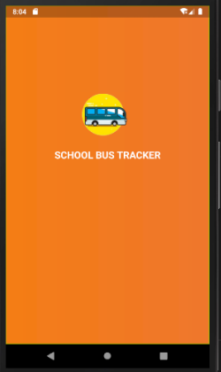

# School Bus Tracker

This is a project to keep track of students within various schools.
This helps to prevent kidnapping 



## Getting Started

```bash
	git clone https://github.com/king-kloy/bus_tracker_app.git
	
	# change to the project directory
	cd bus_tracker_app
	
	# to run the app make sure you've android emulator installed
	# and the flutter sdk too
	flutter run
```

### Happy Hacking
